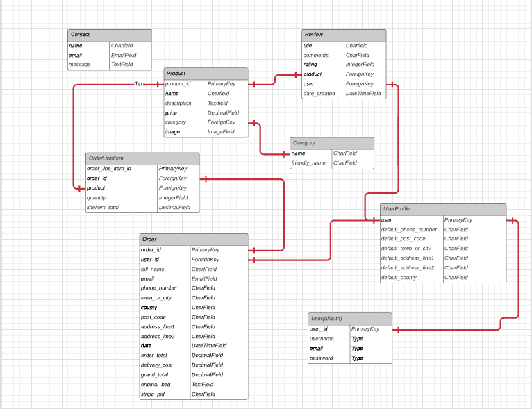
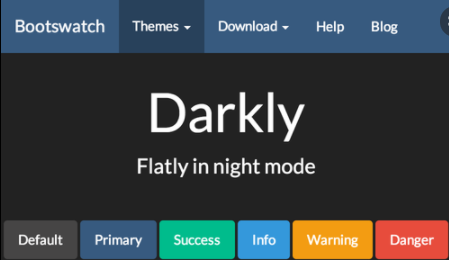

# Energy Gym

The live version of the site is available [here](https://energy-gym-ms4.herokuapp.com/)

This project was created for my fourth and final Milestone Project with Code Institute in order to display my knowledge and understanding 
of HTML, CSS, JavaScript, Python+Django, MySQL and Stripe payments.

I remember I really wanted to create a website for a gym for my first project but I held out until now to complete it so I could add the features I wanted to add and have it looking as professional as possible. As someone who is equally passionate about fitness and technology, I know the huge effect a good website can have on the perception of your business. Down the line, I would love to be able to open my own fitness studio so this project is going to be the first step in acheiving that goal. I want this site to be simple and sleek with strong images and minimal text. This site will be the place users come to sign up easily for quicker checkout experience and be able to purchase their membership option. The members will also be able to leave reviews on the gym and the products to create a community feel where feedback is always appreciated and listened to.

---

## Table of Contents
* [User Experience](#User-Experience)
    * [The Strategy Plane](#The-Strategy-Plane)
        * [User stories](#User-Stories)
    * [The Structure Plane](#The-Structure-Plane)
    * [The Skeleton Plane](#The-Skeleton-Plane)
        * [Wireframes](#Wireframes)
        * [Database Design](#Database-Schema)
    * [The Surface Plane](#The-Surface-Plane)
        * [Design](#Design)
            * [Font](#Font)
            * [Images](#Images)
            * [Colour Scheme](#colour-scheme)
* [Features](#Features)
    - [Site Wide Features](#Site-Wide-Features)
    - [Home Page](#Home-Page)
    - [Products Page](#Products-Page)
    - [Product Detail Page](#Product-Detail-Page)
    - [Contact Page](#Contact-Page)
    - [Login Page](#Login-Page)
    - [Sign Up Page](#Sign-Up-Page)
    - [Profile Page](#Profile-Page)
    - [Future Features to Implement](#future-features-to-implement)
* [Technologies Used](#Technologies-Used)
    - [Languages](#languages)
    - [Tools](#tools)
* [Testing](#testing)
* [Security](#security)
* [Deployment](#deployment)
    * [Initial Creation](#initial-creation)
    * [Deployment to Heroku](#deployment-to-heroku)
        - [Create the app on Heroku](#create-the-app-on-heroku)
        - [Connect Heroku to Github](#connect-heroku-to-github)
        - [Set environment variables](#set-environment-variables)
        - [Automatic Deployment](#automatic-deployment)
* [Credits](#credits)
    * [Content](#content)
    * [Media](#media)
    * [Acknowledgements](#acknowledgements)

--- 

## User Experience
### The Strategy Plane
Energy Gym is a site that myself and a friend want built for a potential business idea. Both of us are keen gym goers and really appreciate the power of a good website. Down the line, we plan to open a gym in Dublin city and we will use this project as the beginning of our new, exciting adventure.

We both have similar opinions on how our site shoud look and function. We want a clean , classy site with sharp images and minimal text. We want users to be able to be create an account and have the choice of four membership options - 1, 3, 6 months or annual memberships. Users will be able to purchase membership options, class bundles and gym merchandise on the site and down the line many more features will be added which I will expand onmore in the future features section.

### User stories
- As a first time user, I want to be able to easily navigate across the site so I can find the content quickly
- As a first time user, I want to know the purpose of the site immediately upon arrival
- As a first time user, I want to see information about the gym and their values
- As a first time user, I want to be able to find information about the membership, class bundles and products for sale on the site
- As a user, I want the site to be responsive across all devices
- As a user, I want to be able to easily create an account
- As a user, I want to be able to be able to search for the products in the search area in the navbar
- As a registered user, I want my details to autofill in the checkout page
- As a user, I want to be able to view my order in the cart before paying to review
- As a user I want to be able to pay securely
- As a user, I want to be able to remove a product from my bag
- As a logged in user, I want to be able to leave a review on the product detail page
- As a logged in user, I want to be able to view my previous orders
- As a user, I want to be able to view other users reviews
- As a user, I want to be able to contact the site owner with any questions or queries

### User stories - Admin
- As an admin user, I want to be able to add, edit and delete products on the site
- As an admin user, I want to be able to delete reviews that might contain harmful or inappropriate content
- As an admin user, I want to prevent unauthorized users from having access to Admin content and other users' profiles.

### The Structure Plane
#### Features
##### Site Wide Features
- Sticky Navbar with site logo  "Energy", directing users back to the home page
- Navbar containing links to Home, Shop, Contact, Account, Bag and search bar
- Responsive navbar on mobile device, collapsing into burger icon
- Footer containing social links

##### Home Page
- Hero-video on landing page
- Button in middle of video prompting user to sign up 
- Description of type of products available
- Button linking to products page
- About section giving information about the history of the gym
- Section including information about the values of the gym 

##### Products Page
- Contains headers corresponding to category type of products
- Contains product images, price, name and description
- Each product image contains a link to product description page
- 

##### Product Detail Page

##### Contact Page

##### Login Page

##### Sign Up Page

##### Profile Page

##### Future Features to Implement
Given the size and complexity of this project, I was unable to add all the features and code I would have liked to. Below is a list of features that I will implement in the 
future:
- Class timetable model and template where users can book in to a variety of fitness classes
- Functionality to only allow users to book a membership for the stated duration of time 
- Add more gym merchandise to include water bottles, shakers and gym hoodies
- Connect the contact page to send email to site owner as it is currently only appearing on the admin page
- Add a quick add to bag feature on the all products page for an easier checkout experience

---
## The Skeleton Plane
#### Wireframes

The wireframes were created using [Balsamiq wireframes](https://balsamiq.com/)

The wireframe mockup links can be found below:
* [Home Page Wireframes Desktop](documentation/wireframes/Home-Page-Desktop.png)
* [Home Page Wireframes Mobile](documentation/wireframes/Home-Page-Mobile.png)

* [Shop Page Wireframes Desktop](documentation/wireframes/Shop-Page-Desktop.png)
* [Shop Page Wireframes Mobile](documentation/wireframes/Shop-Page-Mobile.png)

* [Contact Page Wireframes Desktop](documentation/wireframes/Contact-Page-Desktop.png)
* [Contact Page Wireframes Mobile](documentation/wireframes/Contact-Page-Mobile.png)

* [Product Detail Page Wireframes Desktop](documentation/wireframes/Product-Detail-Page-Desktop.png)
* [Product Detail Page Wireframes Mobile](documentation/wireframes/Product-Detail-Page-Mobile.png)

* [Bag Page Wireframes Desktop](documentation/wireframes/Bag-Page-Desktop.png)
* [Bag Page Wireframes Mobile](documentation/wireframes/Bag-Page-Mobile.png)

* [Checkout Page Wireframes Desktop](documentation/wireframes/Checkout-Page-Desktop.png)
* [Checkout Page Wireframes Mobile](documentation/wireframes/Checkout-Page-Mobile.png)

* [Checkout Success Page Wireframes Desktop](documentation/wireframes/Checkout-Success-Page-Desktop.png)
* [Checkout Success Page Wireframes Mobile](documentation/wireframes/Checkout-Success-Page-Mobile.png)

* [Profile Page Wireframes Desktop](documentation/wireframes/Profile-Page-Desktop.png)
* [Profile Page Wireframes Mobile](documentation/wireframes/Profile-Page-Mobile.png)

* [Sign In Page Wireframes Desktop](documentation/wireframes/Sign-In-Page-Desktop.png)
* [Sign In Page Wireframes Mobile](documentation/wireframes/Sign-In-Page-Mobile.png)

* [Product Management Page Wireframes Desktop](documentation/wireframes/Sign-Up-Desktop.png)
* [Sign Up Page Wireframes Mobile](documentation/wireframes/Sign-Up-Mobile.png)

* [Sign Up Page Wireframes Desktop](documentation/wireframes/Product-Management-Desktop.png)
* [Sign Up Page Wireframes Mobile](documentation/wireframes/Product-Management-Mobile.png)


#### Database Schema



#### Key Models 

Products
- This model alongside the Category model are the foundation of the site's purpose. This model stores all the site products that are for sale
- The price for each product/membership is stored in this model. 
- Each individual product contains its own unique description and each product is referenced using a Primary Key which is generated each time a new item is created. 
- The product images are also stored in this model. 
- Has a Foreign Key from the Category model

Category
- The Category model contains three different categories that the Product model can fall under, acting as a Primary Key

OrderLineItem
- This model stores an instance of a product along with the `lineitem_total` which updates the price in the checkout. 

Order
- This model stores the information that is found in an order, including the user, billing information, address information, the date of the transaction, the user's contact information and the `stripe_pid`.

UserProfile
- This model is created for each user when they register with the site. It stores the user's profile information in the checkout form after their first purchase to allow for quicker and more convenient purchases in the future. 

- It is also linked to the allauth User model when a user registers with the site. 

Reviews
- This model allows the user to add reviews on the site. It connects to the UserProfile in the `user` and allows the user to add their own reviews to the site by storing them in the database. It also stores the date of the review to show how recent an individual review is. 
- The admin user has the power to delete any reviews they deem to be inappropriate or harmful

Contact
- This model allows users, both registered and unregistered, to contact the site owners with any questions and queries

---
## The Surface Plane
### Design
#### Font
Using the <a href="https://fontpair.co/">Font Pair</a> website, I chose two complimentary fonts; <a href="https://fonts.google.com/specimen/Asap">Asap</a> 
for the headings, and <a href="https://fonts.google.com/specimen/Roboto">Roboto</a> for the rest of the text.

#### Images
All the images on the site are taken from [Unsplash](https://unsplash.com/) and are of either people working out in a gym environment or of gym equipment

#### Colour Scheme
I used [BootsWatch](https://bootswatch.com/) Darkly theme for my Bootstrap website, specifically for the navbar and buttons. Please see the image below for the colour scheme:



I also added elements of #57753c, a green colour to match the green on the sole of the shoe in the hero image.

---
## Technologies Used
- [HTML5](https://en.wikipedia.org/wiki/HTML5) 
    - The project uses **HTML** as the main language for structuring the content
- [CSS3](https://en.wikipedia.org/wiki/CSS) 
    - The project uses **CSS** for styling the sites content
- [Django](https://docs.djangoproject.com/en/3.1/)
    - Django was used as the main python framework in the building of this project.
- [jQuery](https://jquery.com/)
    - This framework was used to create some of the site's interactive functions.
- [Python](https://www.python.org/)
    - This project uses **Python** for the backend of the website

        - The following were additionally used:
            - asgiref==3.4.1
            - boto3==1.20.10
            - botocore==1.23.10
            - crispy-bootstrap5==0.6
            - dj-database-url==0.5.0
            - Django==3.2.8
            - django-allauth==0.41.0
            - django-crispy-forms==1.13.0
            - django-storages==1.12.3
            - gunicorn==20.1.0
            - jmespath==0.10.0
            - oauthlib==3.1.1
            - Pillow==8.4.0
            - psycopg2-binary==2.9.2
            - python3-openid==3.2.0
            - pytz==2021.3
            - requests-oauthlib==1.3.0
            - s3transfer==0.5.0
            - sqlparse==0.4.2
            - stripe==2.62.0
### Tools
- [GitHub](https://github.com/) 
    - This is the hosting site where I first created the repository for this webpage and also where the live site is deployed from 
- [Git](https://git-scm.com/) 
    - This is the version control software used where can I commit and push the updated information to the hosting website GitHub
- [BootsWatch](https://bootswatch.com/)
    - This was used as a theme for Bootstrap
- [PyMongo](https://pymongo.readthedocs.io/)
    - This was used as a tool to allow interaction between Python and MongoDB
- [Heroku](https://id.heroku.com)
    - This was used to deploy the live website
- [Heroku Postgres](https://www.heroku.com/postgres)
    - Heroku was used as the database for this project in production mode after deployment to Heroku.
- [Jinja](https://jinja.palletsprojects.com/en/3.0.x/)
    - Jinja was used for templating.
- [Balsamiq](https://balsamiq.com/) 
    - This was used to create my rough wireframes
- [Favicon](https://favicon.io/)
    - This was used to create the sites Favicon of an olive branch
- [Font Pair](https://fontpair.co/) 
    - This was used to choose complementary fonts
- [Fontawesome](https://fontawesome.com/)
    - The icons used on this page were found in Fontawesome.
- [Tiny JPG](https://tinyjpg.com/) 
    - This was used this to compress my images
- [Chrome DevTools](https://developers.google.com/web/tools/chrome-devtools)
    - This was used to inspect elements on the page and help debug issues involving the 
    site layout
- [PEP8 Online](http://pep8online.com/)
    - This was used to check for PEP8 compliance
- [JSHint](https://jshint.com/)
    - This was used to check my javascript code
- [W3C CSS validator](https://jigsaw.w3.org/css-validator/)
    - This was used to test the CSS code for any errors
- [W3C Markup validator](https://validator.w3.org/)
    - This was used to test the HTML code for any errors
- [Jinja](https://jinja.palletsprojects.com/en/3.0.x/)
    - This was used as a web template engine for the Python language 
- [Web Accessibility](https://www.webaccessibility.com/)
    - This was used to test the accessibility of this site for users with disabilities
- [Free Logo Design](https://www.freelogodesign.org/)
    - This was used to create the site logo
- [Stripe](https://stripe.com/ie)
    - Stripe payments were used to build the card payment system of this site.
- [AWS-Amazon Web Services](https://aws.amazon.com/)
    - AWS was used to store all media and static files of this site in production mode.
- [Am I Responsive](http://ami.responsivedesign.is/)
    - This was used to test the responsiveness of the site and also to create the mock-up image at the top of this document.
- [Lucid](https://lucid.app/documents#/dashboard)
    - This was used to create the Database Schema presented in this document.
- [Google Fonts](https://fonts.google.com/) 
    - This was used to import the two fonts for this site, Asap and Roboto


[Back to top](#Table-of-Contents)

---

## Testing
The testing documentation can be found [here](TESTING.md)

---

## Security 
I have stored all sensitive information in my env.py file which is ignored. Any user that registers an account will have their password undergo password hashing as an extra security measure. A lot of the sites features can only be access by admin users such as the CRUD functionality for the products page.

---
## Deployment 
### Initial Creation
Wedding App was first created by completing the following steps on GitHub:
1. Open [Github](https://github.com/) page up in browser
2. Log in using your username and password
3. Click the "New" green button to the left-hand side repository section
4. Click template dropdown menu and select the "Code Institute Full Template"
5. Enter name of project "Energy_Gym_MS4"
6. Click "Create repository"
7. Click the green "Gitpod" button ONCE to redirect to the Gitpod workspace
8. Open via [Gitpod Workspaces](https://gitpod.io/workspaces/) only, from then on

Throughout development, three primary commands were used with the CLI [Git](https://git-scm.com/) and were as follows :

- "git add" followed by the file name you wish to stage or "git add ." stages all unstaged files
- "git commit -m" followed by a detailed comprehensive comment pertaining to the changes made since the previous commit
- "git push" makes all changes visible on the GitHub Repo

In order to deploy the site to Heroku, the four following steps must be followed:
1. Create a requirements.txt file that contains the names of packages being used in Python. It is critical to update this file if other packages or modules are installed during project development to reflect the current requirements by using the following command:
- pip freeze --local > requirements.txt
2. Create a Procfile that contains the name of the application file so that Heroku knows what to run. Ensure to remove the blank line at the beginning of the Procfile as this may cause problems.
3. Push these files to GitHub.
4. Install `psycopg2` and `dj_datatbase_url` in your workspace cli.

When the above steps are complete, the app is ready to deploy to Heroku:

### Deployment Steps

1. Log into Heroku .
2. Click the New button.
3. Click the option to create a new app.
4. Enter the app name in lowercase letters.
5. Select the correct geographical region.

### Connect Heroku app to Github repository

1. In heroku select the deploy tab.
2. Click github button.
3. Enter the repository name and click search.
4. Select the relevant repository and click connect. 

### Add Heroku Postgres Database
1. Click the resources tab in heroku.
2. Under Add-ons search for heroku postgres.
3. Click on heroku postgres when it appears. 
4. Select the Hobby Dev-Free option in plans. 
5. Click submit order form.

### Setting up environment variables
1. In the heroku settings click the reveal config vars button and set the following variables:
    - AWS_ACCESS_KEY_ID
    - AWS_SECRET_ACCESS_KEY
    - EMAIL_HOST_PASS
    - EMAIL_HOST_USER
    - SECRET_KEY
    - STRIPE_PRICE_ID
    - STRIPE_PUBLIC_KEY
    - STRIPE_SECRET_KEY
    - STRIPE_WH_SECRET
    - USE_AWS
    - DATABASE_URL

- The values of these variables are sensitive and for security purposes will not be shared here.

### Setting up the AWS s3 bucket
1. Create an Amazon AWS account
2. Search for S3 and create a new bucket
    - Allow public access
3. Under Properties > Static website hosting
    - Enable
    - index.html as index.html
    - save
4. Under Permissions > CORS use the following:
```
[
  {
      "AllowedHeaders": [
          "Authorization"
      ],
      "AllowedMethods": [
          "GET"
      ],
      "AllowedOrigins": [
          "*"
      ],
      "ExposeHeaders": []
  }
]
```
5. Under Permissions > Bucket Policy:
    - Generate Bucket Policy and take note of Bucket ARN
    - Chose S3 Bucket Policy as Type of Policy
    - For Principal, enter *
    - Enter ARN noted above
    - Add Statement
    - Generate Policy
    - Copy Policy JSON Document
    - Paste policy into Edit Bucket policy on the previous tab
    - Save changes
6. Under Access Control List (ACL):
    - For Everyone (public access), tick List
    - Accept that everyone in the world may access the Bucket
    - Save changes

### AWS IAM (Identity and Access Management) setup
1. From the IAM dashboard within AWS, select User Groups:
    - Create a new group
    - Click through and Create Group
2. Select Policies:
    - Create policy
    - Under JSON tab, click Import managed policy
    - Choose AmazongS3FullAccess
    - Edit the resource to include the Bucket ARN noted earlier when creating the Bucket Policy
    - Click next step and go to Review policy
    - Give the policy a name and description of your choice
    - Create policy
3. Go back to User Groups and choose the group created earlier
    - Under Permissions > Add permissions, choose Attach Policies and select the one just created
    - Add permissions
4. Under Users:
    - Choose a user name 
    - Select Programmatic access as the Access type
    - Click Next
    - Add the user to the Group just created
    - Click Next and Create User
5. Download the `.csv` containing the access key and secret access key.
    - **THE `.csv` FILE IS ONLY AVAILABLE ONCE AND CANNOT BE DOWNLOADED AGAIN.**

### Connecting Heroku to AWS S3
1. Install boto3 and django-storages
```
pip3 install boto3
pip3 install django-storages
pip3 freeze > requirements.txt
```
2. Add the values from the `.csv` you downloaded to your Heroku Config Vars under Settings:
3. Delete the `DISABLE_COLLECTSTATIC` variable from your Config vars and deploy your Heroku app
4. With your S3 bucket now set up, you can create a new folder called media (at the same level as the newly added static folder) and upload any required media files to it.
    - **NB PLEASE MAKE SURE `media` AND `static` FILES ARE PUBLICLY ACCESSIBLE UNDER PERMISSIONS**


### Enable automatic deployment:

1. Click the Deploy tab
2. In the Automatic deploys section, choose the branch you want to deploy from then click Enable Automation Deploys.


### Connect app to Github Repository

1. Click the deploy tab and connect to GitHub.
2. Type the name of the repository into the search bar presented.
3. Click the Code dropdown button next to the green Gitpod button.
4. When the correct repository displays click the connect button.

### Making a clone to run locally

It is important to note that this project will not run locally unless an env.py file has been set up by the user which contains the IP, PORT, MONGO_DBNAME, MONGO_URI and SECRET_KEY which have all been kept secret in keeping with best security practices. 

1. Log into GitHub.
2. Select the [respository](https://github.com/AideenM12/Joyce-English-School-MS4).
3. Click the Code dropdown button next to the green Gitpod button.
4. Download ZIP file and unpackage locally and open with IDE. Alternatively copy the URL in the HTTPS box.
5. Open the alternative editor and terminal window.
6. Type 'git clone' and paste the copied URL.
7. Press Enter. A local clone will be created.

Once the project been loaded into the IDE it is necessary to install the necessary requirements which can be done by typing the following command.

    -pip install -r requirements.txt

---
## Credits
### Content
- A large portion of this milestone project's code was inspired and taken from Code Institutes Boutique Ado walkthrough. These tutorials were crucial for the skeleton of this site and it's functionality.
- The add review collapsable component was taken from [here](https://getbootstrap.com/docs/5.0/components/collapse/)
- Inspiration for my reviews model was taken from this informative [YouTube tutorial](https://www.youtube.com/watch?v=lSX8nzu9ozg)
- I watched this [YouTube video](https://www.youtube.com/watch?v=fEoQsPvcZGs) to get a deeper understanding of how to create custom error pages
- [StackOverflow](https://stackoverflow.com/) was an invaluable resource for searching styling issues, python errors etc

### Media
- The favicon for this site was taken from [favicon.io](https://favicon.io/)
- The logo for this site was created on [Free Logo Design](https://www.freelogodesign.org/)
- The images for this site were all taken from [Unsplash](https://unsplash.com/)

### Acknowledgements
- First and foremost, a huge thank you to my brother Gregory for his patience and understanding throughout this entire course. From MS1 to MS4, he was only ever a phonecall away to explain anything I was struggling with. If I haven't said it enough, THANK YOU!!!
- I would like to thank my mentor Felipe for his guidance throughout these milestone projects. His calm, positive approach always made me feel more confident about my project. 
- I would like to thank tutor support who I have definitely leaned on a lot more for this milestone project compared to others. They were always quick and efficient at responding to any questions or queries I had!
- I would like to thank the entire Slack community, past and present. A lot of my problems were solved by searching Slack and seeing someone had the exact same problem a year ago, making it much easier for me to resolve it quickly.
- A huge thank you to my family and boyfriend for their support throughout this course. They have been so encouraging and understanding from the beginning. This last project has been particularly difficult to juggle but their words of encouragement pushed me on. They have helped test my projects throughout development and have provided feedback on areas of the sites I could improve on!
- I would like to thank Code Institute for the amazing course matieral and project walkthroughs, making the milestone projects a lot more manageable 

---

[Back to top](#Table-of-Contents)