## Table of Contents
* [Testing](#Testing)
    * [Responsivity across devices](#Responsivity-across-devices)
    * [HTML CSS and Python Testing](#HTML-CSS-and-Python-Testing)
    * [Web Accessibility](#Web-Accessibility)

* [User Story Testing](#User-Story-Testing)
    * [Test Case 1](#Test-Case-1)
    * [Test Case 2](#Test-Case-2)
    * [Test Case 3](#Test-Case-3)
    * [Test Case 4](#Test-Case-4)
    * [Test Case 5](#Test-Case-5)
    * [Test Case 6](#Test-Case-6)
    * [Test Case 7](#Test-Case-7)
    * [Test Case 8](#Test-Case-8)
    * [Test Case 9](#Test-Case-9)
    * [Test Case 10](#Test-Case-10)
    * [Test Case 11](#Test-Case-11)
    * [Test Case 12](#Test-Case-12)
    * [Test Case 13](#Test-Case-13)
    * [Test Cases Admin](#Test-Cases-Admin)
        * [Test Case 14](#Test-Case-14)
        * [Test Case 15](#Test-Case-15)

* [Issues and Solutions](#Issues-and-Solutions)

## Testing
### Responsivity across devices
* As a user, I want the website to be responsive across all devices
This test allowed me to ensure the user story for responsivity was met
    - I checked the site across [Google Chrome](https://www.google.com/intl/en_ie/chrome/), [Mozilla Firefox](https://www.mozilla.org/en-US/firefox/new/), [Safari](https://www.apple.com/safari/) and [Opera](https://www.opera.com/) and all pages were completely responsive  with the layout remaining intact.
    - Using [Chrome DevTools](https://developers.google.com/web/tools/chrome-devtools), (to open I right-clicked anywhere on my website and clicked "Inspect" or clicked "F12" on the keyboard), I ran my site in mobile/tablet display across the following devices: Galaxy Note 3, Galaxy S III, Moto G4, iPhone 4, Galaxy S5, Pixel 2, Pixel 2 XL, iPhone 5/SE, iPhone 6/7/8, iPhone 6/7/8 Plus, iPhone X, iPad, iPad Pro. Everything ran normally on these devices. 
    I also sent my site to some friends and family to open on their phones. 

---
### HTML CSS and Python Testing
1. W3C HTML Validator
- I opened [W3C HTML Validator](https://validator.w3.org/) and selected the "Validate by URI" option and paste each html page
- I received a minor error about the a element having a type="button" so I removed this from my HTML files
- After fixing this error, I received the following message about all my HTML files:

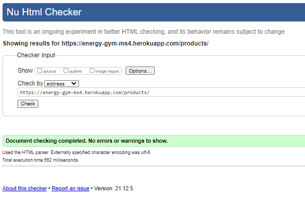

---
2. Similarly, I ran the code through the [W3C CSS Validator](https://jigsaw.w3.org/css-validator/) 
- I selected the "by Direct Input" option and pasted all my css files code in separately
- I received the following message for all:

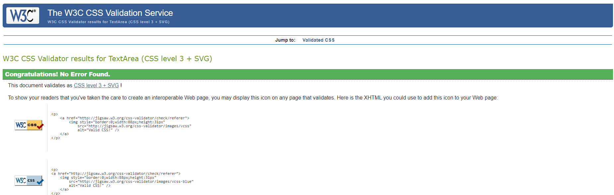

---
3. Python PEP8 Compliant
I copy and pasted the code of all my files ending in .py into the text box on [PEP8 site](http://pep8online.com/) 
- I had a few minor errors of the lines being too long which I fixed
- Four lines in settings.py were flagged as being too long but these were auto-generated by Django and I had to leave them as was to maintain the functionality of the app:

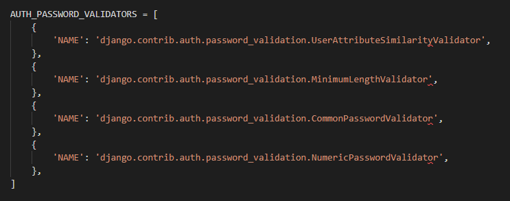

- Then it returned this message of no errors:

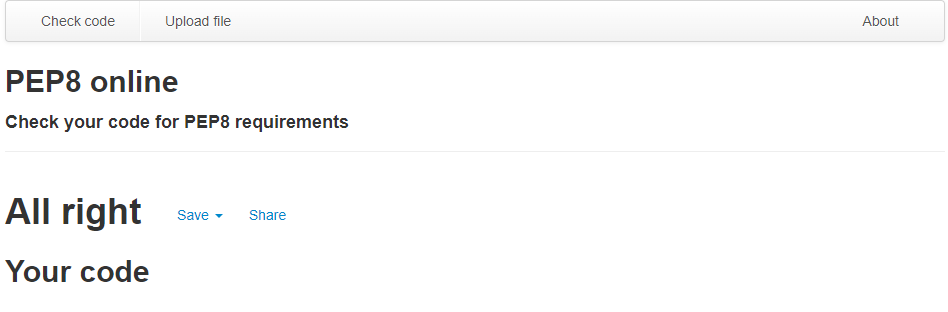
---

### Web Accessibility
I tested the sites homepage on [Web Accessibility](https://www.webaccessibility.com/) to ensure the site was able to be used by people with disabilities 
and received at least 93% across all pages:

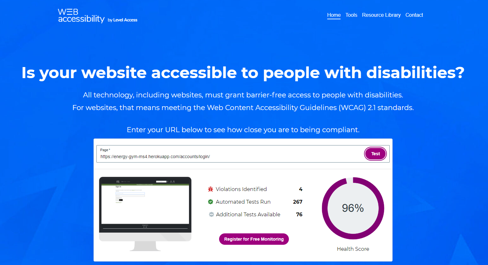

---

[Back to top](#Table-of-Contents)

## Manual Testing
I conducted tests on all user stories and features on the site:
For all test cases, I opened the web application via this [link](https://wedding-app-ms3.herokuapp.com/)

### Test Case 1
- As a first time user, I want to be able to easily navigate across the site so I can find the content quickly

**Description**
Verify that the site provides the user with an intuitively designed site.

**Steps**
1. Open an internet browser.
2. Navigate to [https://energy-gym-ms4.herokuapp.com/](https://energy-gym-ms4.herokuapp.com/)
3. Select the tab of choice in the navigation bar.
4. Use the navigation and footer links to explore the site and find the appropriate pages/information.

**Expected Result:**
A navigation bar and footer will provide the user with links to the site's content that they can use intuitively.

**Actual Result:**
A navigation bar and footer provides the user with links to the site's content that they can use intuitively. 

**Pass/Fail:**
Pass


### Test Case 2
- As a first time user, I want to know the purpose of the site immediately upon arrival

**Description**
Verify that the site's purpose is clear when a user navigates to the site landing page.

**Steps**
1. Open an internet browser.
2. Navigate to [https://energy-gym-ms4.herokuapp.com/](https://energy-gym-ms4.herokuapp.com/)
3. Scroll to the content directly beneath the site's first image.
4. Read the site description directly beneath the image in order to understand the site's purpose.

**Expected Result:**
Content below the hero image with text explaining the site's purpose will be displayed.

**Actual Result:**
Content below the hero image with text explaining the site's purpose is displayed.

**Pass/Fail:**
Pass

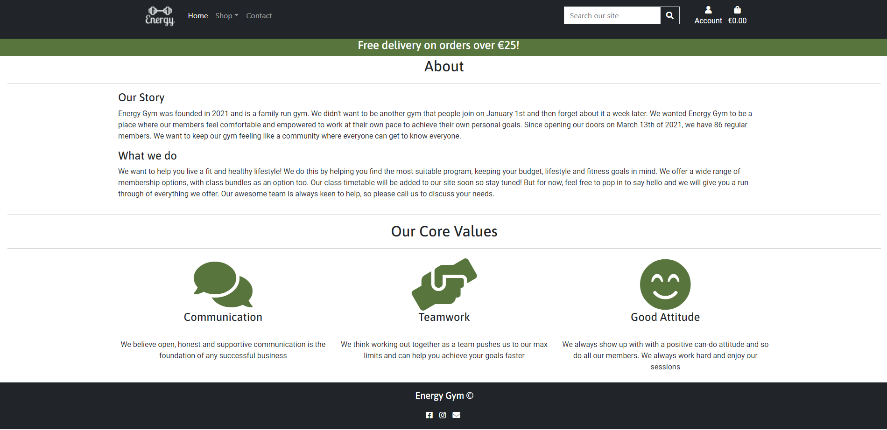

### Test Case 3
- As a first time user, I want to be able to find information about the membership, class bundles and products for sale on the site

**Description**
Verify that the site contains information about the membership, class bundles and products for sale on the site

**Steps**
1. Open an internet browser.
2. Navigate to [https://energy-gym-ms4.herokuapp.com/](https://energy-gym-ms4.herokuapp.com/)
3. Navigate to the Shop nav-item 
4. Observe the various products/services available for sale

**Expected Result:**
A page with a description of all the products/ services available.

**Actual Result:**
A page with a description of all the products/ services available.

**Pass/Fail:**
Pass

### Test Case 4

- As a user, I want to be able to easily create an account

**Description**
Verify that the site provides the user with an opportunity to create an account easily. 

**Steps**
1. Open an internet browser.
2. Navigate to [https://energy-gym-ms4.herokuapp.com/](https://energy-gym-ms4.herokuapp.com/)
3. Navigate to the sign up page 
4. Fill in the the sign up form as required.
5. Verify email address as instructed.
6. Log in with the credentials that were created when filling out the registration form. 

**Expected Result:**
A registration form will be provided and once successfully completed and verified, the user will be able to sign in using these details

**Actual Result:**
A registration form is provided and once successfully completed and verified, the user is able to sign in using these details

**Pass/Fail:**
Pass

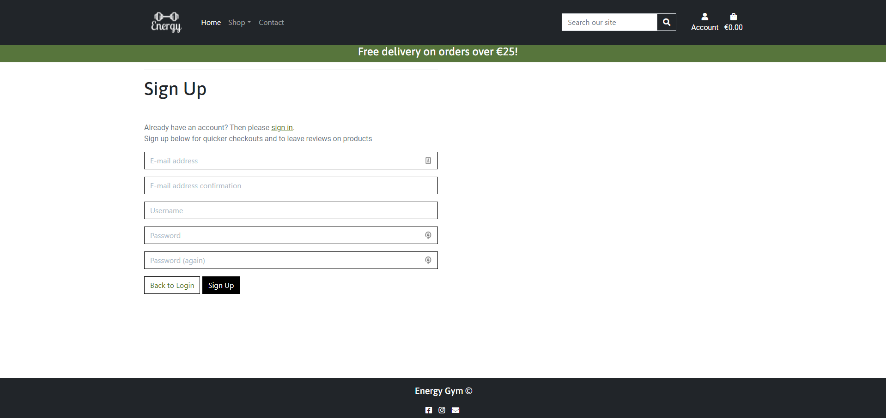

### Test Case 5

- As a user, I want to be able to be able to search for the products in the search area in the navbar

**Description**
Verify that the user can search for products/services

**Steps**
1. Open an internet browser.
2. Navigate to [https://energy-gym-ms4.herokuapp.com/](https://energy-gym-ms4.herokuapp.com/)
3. Enter 'green'' into the search field in the navbar
4. Check that the product with the word 'green' in it is shown

**Expected Result:**
The search bar will return the products that the user searched for if the product exists

**Actual Result:**
The search bar returns the products that the user searched for if the product exists

**Pass/Fail:**
Pass


### Test Case 6

- As a registered user, I want my details to autofill in the checkout page

**Description**
Verify that the registered users details autofill in the checkout page

**Steps**
1. Open an internet browser.
2. Navigate to [https://energy-gym-ms4.herokuapp.com/](https://energy-gym-ms4.herokuapp.com/)
3. Navigate to the log in page and enter credentials
4. Ensure default delivery details are saved in the profile page 
5. Add product to the bag and nagivate to checkout page
6. Check that default delivery details are populated

**Expected Result:**
The registered users details will autopopulate in the checkout page

**Actual Result:**
The registered users details autopopulate in the checkout page

**Pass/Fail:**
Pass

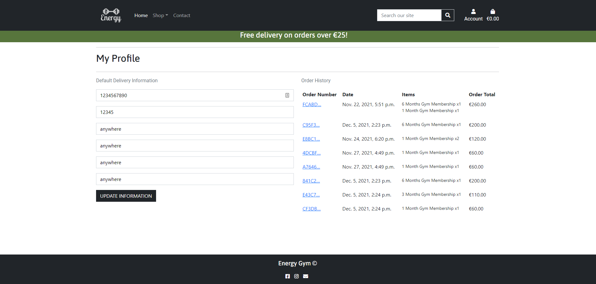

### Test Case 7
- As a user I want to be able to pay securely

**Description**
Verify that the site provides the user with a secure and simple card payments system. 

**Steps**
1. Open an internet browser.
2. Navigate to [https://energy-gym-ms4.herokuapp.com/](https://energy-gym-ms4.herokuapp.com/)
3. Select the Log In tab in the navigation bar.
4. Enter log in details. 
5. Navigate to the Shop page.
6. Click on a product/service of choice. 
7. Click the "Add to Bag" button beneath the product's description.
8. Navigate to the Bag page.
9. Click the "Secure Checkout"button.
10. Fill out the payment form as instructed.
11. Observe the checkout success page with the order details

**Expected Result:**
The checkout system will be secure and simplistic for ease of use.

**Actual Result:**
The checkout system is secure and simplistic for ease of use.

**Pass/Fail:**
Pass

### Test Case 8
- As a user, I want to be able to remove a product from my bag

**Description**
Verify that the user can remove a product from their bag

**Steps**
1. Open an internet browser.
2. Navigate to [https://energy-gym-ms4.herokuapp.com/](https://energy-gym-ms4.herokuapp.com/)
3. Navigate to the Shop page.
4. Click on a product of your choice.
5. Click the 'Add to Bag' button.
6. Click the Bag icon in the top right corner.
7. Click the Remove button 
8. Observe the total reflect the recent changes

**Expected Result:**
The user will be successfully able to remove a product from their bag

**Actual Result:**
The user is successfully able to remove a product from their bag

**Pass/Fail:**
Pass

### Test Case 9
- As a logged in user, I want to be able to leave a review on the product detail page

**Description**
Verify that the site provides the user with the ability to leave reviews on the products.

**Steps**
1. Open an internet browser.
2. Navigate to [https://energy-gym-ms4.herokuapp.com/](https://energy-gym-ms4.herokuapp.com/)
3. Select the Log In tab in the navigation bar.
4. Enter log in details. 
5. Navigate to a product detail page of your choice.
6. Scroll to the bottom of the page.
7. Click the 'Add a Review' button. 
8. Fill out the form as instructed and click the 'Add Review' button.
9. Observe the recently created review under the product description.

**Expected Result:**
The user will be able to successfully leave a review.

**Actual Result:**
The user is able to successfully leave a review.

**Pass/Fail:**
Pass

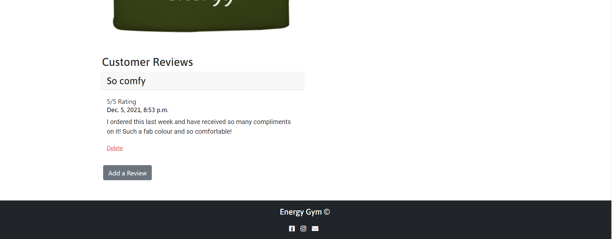

### Test Case 10
- As a logged in user, I want to be able to view my previous orders

**Description**
Verify that the user has the ability to access their order history easily.

**Steps**
1. Open an internet browser.
2. Navigate to [https://energy-gym-ms4.herokuapp.com/](https://energy-gym-ms4.herokuapp.com/)
3. Select the Log In tab in the navigation bar.
4. Enter log in details. 
5. Navigate to the user's profile page.
6. Scroll to the order history section on the profile page. 
7. Click on an order number to gain more information about that specific order.
8. Observe the details of the selected order. 

**Expected Result:**
The user will be able to view their order history easily.

**Actual Result:**
The user is able to view their order history easily.

**Pass/Fail:**
Pass


### Test Case 11
- As a user, I want to be able to view other users reviews

**Description**
Verify that the user can view reviews on the products.

**Steps**
1. Open an internet browser.
2. Navigate to [https://energy-gym-ms4.herokuapp.com/](https://energy-gym-ms4.herokuapp.com/)
3. Select the Log In tab in the navigation bar.
4. Enter log in details. 
5. Navigate to a product detail page of your choice.
6. Scroll to the bottom of the page.
7. Observe the recently created review under the product description.

**Expected Result:**
The user will be able to view reviews.

**Actual Result:**
The user is be able to view reviews.

**Pass/Fail:**
Pass

### Test Case 12

- As a user, I want to be presented with custom error 404 and 500 pages when appropriate

**Description:**

Verify Error 404 page is displayed when navigating to a page that does not exist

**Steps:**<br>
1. Search for  https://energy-gym-ms4.herokuapp.com/doesnotexist
2. Click enter

**Expected Result:**<br>
404 page should be displayed

**Actual Result:**<br>
404 page is displayed

**Pass/Fail:**<br>
Pass

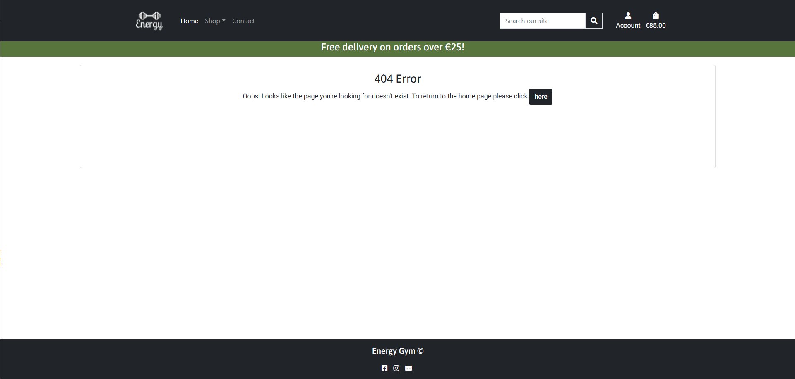


### Test Case 13
- As a user, I want to be able to contact the site owner with any questions or queries

**Description**
Verify that the site provides the user with the ability to contact the gym.

**Steps**
1. Open an internet browser.
2. Navigate to [https://energy-gym-ms4.herokuapp.com/](https://energy-gym-ms4.herokuapp.com/)
3. Navigate to the contact page.
4. Fill out the contact form as instructed.
5. Observe the 'Your request has been sent' message/toast that confirms the gym has received the message. 

**Expected Result:**
The user will be able to contact the gym through the site's contact page.

**Actual Result:**
The user is able to contact the gym through the site's contact page.

**Pass/Fail:**
Pass


### Test Cases Admin

### Test Case 14
- As an admin user, I want to be able to add, edit and delete products on the site

**Description**
Verify that an admin/ superuser has the ability to use CRUD functionality for products

**Steps**
1. Open an internet browser.
2. Navigate to [https://energy-gym-ms4.herokuapp.com/](https://energy-gym-ms4.herokuapp.com/)
3. Log in as admin user
4. Can navigate to https://energy-gym-ms4.herokuapp.com/admin to organise products model
5. Alternatively, the admin user can update, add or delete products on the main site
6. Navigate to Shop page and admin user should see edit and delete buttons under each product
7. Navigate to Product Management under account icon in Navbar to add a product

**Expected Result:**
The admin user will be able to use all CRUD functionality

**Actual Result:**
The admin user is able to use all CRUD functionality

**Pass/Fail:**
Pass

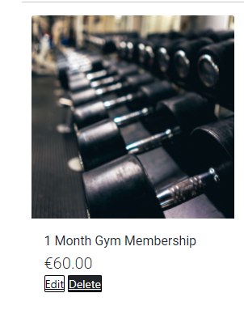

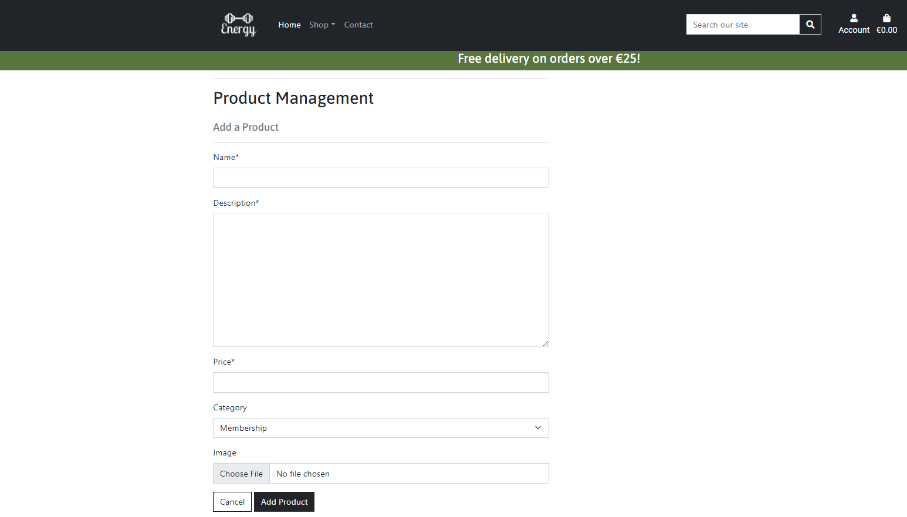

### Test Case 15
- As an admin user, I want to be able to delete reviews that might contain harmful or inappropriate content

**Description**
Verify that the site provides the user with the ability to contact the gym.

**Steps**
1. Open an internet browser.
2. Navigate to [https://energy-gym-ms4.herokuapp.com/](https://energy-gym-ms4.herokuapp.com/)
3. Sign in as admin user
4. Navigate to product detail page where a review has been added
5. Observe delete button
6. Click delete button
7. Oberve review is delete

**Expected Result:**
The admin user will be able to delete any users reviews.

**Actual Result:**
The admin user is able to delete any users reviews.

**Pass/Fail:**
Pass


## Issues and Solutions
This project was the one where I encountered the most bugs and issues which is not surprising given the scope and complexity. 

- The most recent bug I encountered was the webhook event 'payment_intent.succeeded' failing with a 500 error. After a lot of troubleshoot by applying changes, committing and attempting again on the deployed version, I finally figured out that I had changed the subject and body paths to include checkout/templates. This was causing the template not to be found. Once I removed this, the webhook continued to succeed.
- Early on in the project, the totals weren't rendering correctly on the checkout success page. This was to do with an issue with signals.py where I had entered OrderLineItem() instead of just OrderLineItem
- An issue that I was stuck on from the beginning until a day before submission was why my delivery cost function wasn't operating correctly. The delivery was being calculated at 1000% the cost of the item. Again, this was a code error where I forgot to include /100 in the update total function in checkout models.py

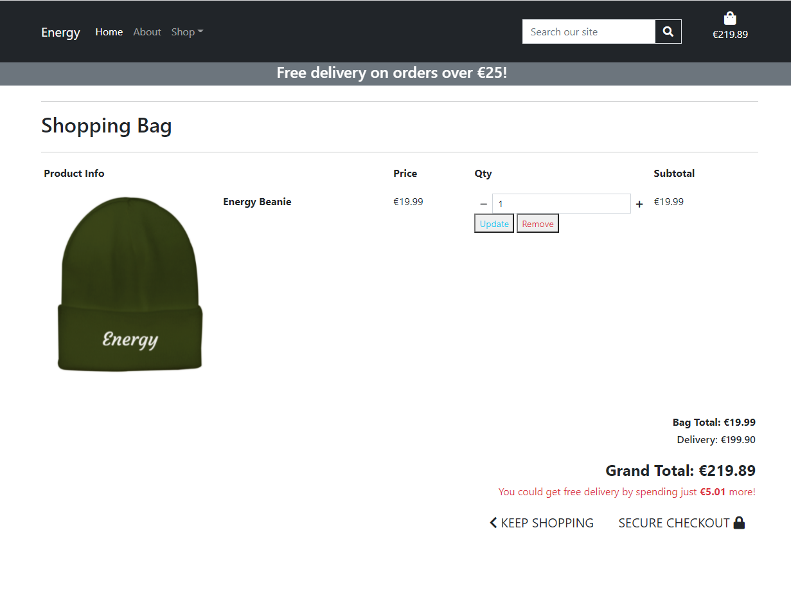

- On the products page, I wanted to have the product category as the heading before each respective group. I ran into a lot of issues where the heading was rendering three times as it was being looped through. I ended up including code to only show categories that have a product and link products to category name for heading in the all_products function which worked as I wanted it to.

```
# only show categories that have a product
        categories = categories.filter(
            name__in=[p.category.name for p in products])

    # Links products to category name for heading
    category_products = {c.name: (c, []) for c in categories}
    for product in products:
        category_products[product.category.name][1].append(product)

    context = {
        'category_products': category_products,
    }
```